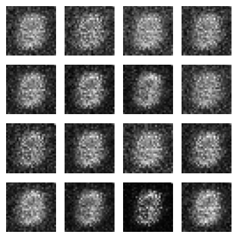
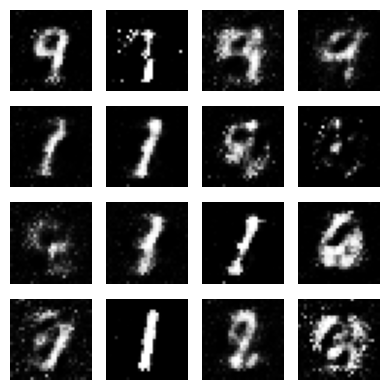
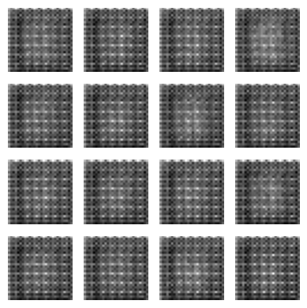
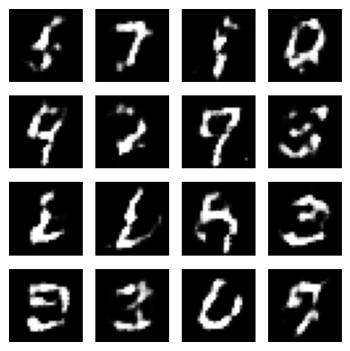
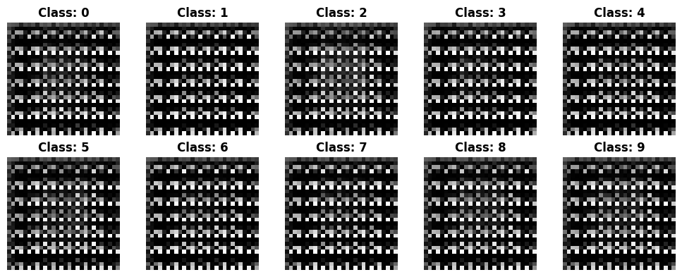
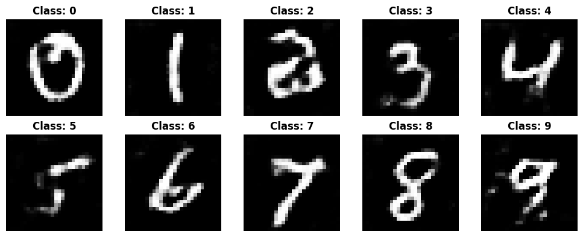

# Number Generator
- Generate numbers with mnist dataset and tGAN, DCGAN, SGAN & CGAN models.
- Using Keras library & tensorflow backend.

----------------------------------------------------------------------------
## tGAN:
- using Dense layers.
- a basic model & the neighborhood of pixels is not considered.
- no feature extraction & no feature maps.

First Samples             |  Latest Samples(18 epoch)
:-------------------------:|:-------------------------:
  |  

## DCGAN:
- using convolutional & deconvolutional layers.
- the neighborhood of pixels is considered.
- feature maps & depth.
- has a cleaner output.

First Samples             |  Latest Samples(8 epoch)
:-------------------------:|:-------------------------:
  |  

## SGAN:
- similar to DCGAN, but useing semi-supervised learning for the discriminator.
- model has a lighter & more accurate discriminator than DCGAN.

First Samples             |  Latest Samples(8 epoch)
:-------------------------:|:-------------------------:
  |  

## CGAN:
- using labeled data to provide context to a conditional GAN.
- allowing to get better, more targeted results from the generator.

First Samples             |  Latest Samples(18 epoch)
:-------------------------:|:-------------------------:
  |  

